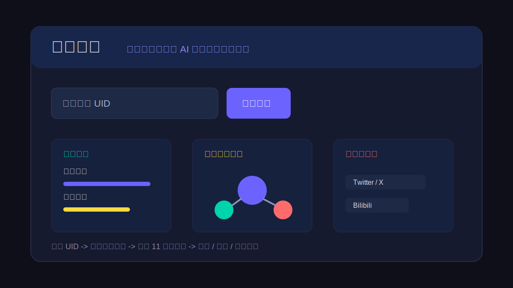

# 数字影子

> 输入一个微博 UID，自动抓取公开微博数据，并用大模型生成一份 11 维度人物画像报告。

[](https://www.python.org/)
[](https://flask.palletsprojects.com/)
[](docs/USAGE.md)
[](#license)



**数字影子** 是一个面向公开社交数据分析的 AI Agent 小工具。它可以根据微博 UID 获取公开可见内容，并生成包含性格、兴趣、表达风格、互动关系、多平台线索和内容主题演变的分析报告。

适合用于：

- 自媒体账号研究和竞品内容观察
- 公开人物的内容画像和表达风格分析
- LLM Agent / OSINT / 社交媒体分析项目学习
- Python + Flask + 大模型应用的完整示例

如果这个项目对你有帮助，欢迎点一个 Star，后续会继续补充更多平台和更完整的分析模板。

## 在线效果

当前项目为本地运行工具，启动后访问 `http://localhost:8080`。你可以输入微博 UID，获取公开微博内容并生成报告。

```bash
python3 server.py
```

报告会覆盖：

| 能力 | 说明 |
|------|------|
| 人物画像 | 身份标签、性格特征、价值观、生活方式 |
| 主题演变 | 分析内容主题是否随时间发生变化 |
| 互动关系 | 提取高频 @对象，生成社交圈层线索 |
| 多平台线索 | 从 bio 和正文中匹配 X、Instagram、B站、小红书、抖音等账号 |
| 追问补充 | 基于已有报告继续追加上下文和深度分析 |

## 功能特性

- **用户搜索**：通过微博昵称搜索用户（需有效 Cookie）
- **UID 直查**：直接输入 UID 获取用户信息，更稳定
- **深度画像报告**：AI 生成 11 维度分析报告（2000+ 字）
- **互动关系图谱**：提取微博中 @提及 的高频用户，分析社交圈层
- **多平台线索**：从微博 bio 和正文中匹配 Twitter/X、Instagram、B站、小红书、抖音等账号线索
- **追问补充**：基于已有报告，输入补充信息继续深入分析
- **报告导出**：支持 TXT 格式下载

## 60 秒快速开始

```bash
git clone https://github.com/mao-bot699/-weibo-digital-shadow.git
cd -weibo-digital-shadow/数字影子-公开版
pip install flask flask-cors openai requests
cp config.py.example config.py
python3 server.py
```

然后打开 `http://localhost:8080`。

完整配置方式见 [docs/USAGE.md](docs/USAGE.md)。

## 分析维度

1. 人物总画像（身份标签、公开形象、人生阶段）
2. 性格与心理特征（语言风格、情绪管理、价值观、MBTI 猜测）
3. 生活方式与日常规律（作息推断、通勤出差、饮食运动、消费偏好）
4. 兴趣爱好与关注领域（核心兴趣、行业圈子、娱乐偏好）
5. 主题演变分析（内容主题变化、阶段转换、表达重心）
6. 社交网络特征（粉丝互动、转发原创比例、影响力层级）
7. 互动关系图谱（高频 @对象、社交圈层、互动模式）
8. 多平台线索分析（跨平台账号线索、可信度评估）
9. 语言与表达特征（语言风格、网络流行语、标点 emoji 习惯）
10. 数据时间线（发博规律、活跃期/沉默期、主题演变）
11. 综合总结（核心特征、三个关键词、出人意料的发现）

## 技术架构

```
┌─────────────┐     HTTP      ┌──────────────┐     API      ┌──────────────┐
│   浏览器    │ ──────────→  │  Flask 后端  │ ─────────→  │  微博 Ajax   │
│  (前端页面) │ ←──────────  │  (server.py) │ ←─────────  │   API        │
└─────────────┘              └──────────────┘              └──────────────┘
                                     │
                                     │ LLM
                                     ↓
                              ┌──────────────┐
                              │  Claude API  │
                              │  (agent.py)  │
                              └──────────────┘
```

### 后端模块

| 文件 | 职责 |
|------|------|
| `server.py` | Flask Web 服务器，提供页面和 REST API |
| `scrapers.py` | 微博数据采集：搜索用户、获取信息、获取微博、清洗文本、提取@提及、提取多平台线索 |
| `agent.py` | LLM 分析模块：构造 prompt、调用模型、生成报告 |
| `config.py` | 微博 Cookie 配置（需自行填入） |

### 前端

单文件 SPA（`templates/index.html`），纯原生 JavaScript，无框架依赖。步骤流程：选择用户 → 配置参数 → 生成报告 → 查看/下载/追问。

## 示例输出

```text
人物总画像：该用户长期围绕科技产品、创业观察和个人表达发布内容。
兴趣领域：AI 工具、消费电子、效率软件、行业趋势。
互动关系：高频 @对象集中在科技媒体、创业者和产品经理圈层。
多平台线索：微博简介和正文中出现疑似 X / B站 / 小红书账号线索。
```

报告基于公开数据和模型推断生成，不应被视为事实证明。

## 安装与配置

### 环境要求

- Python 3.9+
- pip
- 微博账号 Cookie（需自行从浏览器获取）
- LLM API Key（兼容 OpenAI 格式）

### 安装

```bash
git clone https://github.com/mao-bot699/-weibo-digital-shadow.git
cd -weibo-digital-shadow/数字影子-公开版
pip install flask flask-cors openai requests
```

### 配置

1. **配置微博 Cookie**：编辑 `config.py`，填入你的微博 Cookie 字符串

```python
WEIBO_COOKIE = "你的Cookie字符串"
```

2. **配置 LLM**：设置环境变量

```bash
export CLAUDE_API_KEY="你的API Key"
export CLAUDE_BASE_URL="https://api.stepfun.com/step_plan/v1"
export CLAUDE_MODEL="step-3.7-flash"
```

### 运行

```bash
python3 server.py
```

浏览器访问 `http://localhost:8080`

### 命令行模式

```bash
python3 main.py 1749127163 --max-posts 10 --export
```

### Streamlit 模式

```bash
streamlit run app.py
```

## API 接口

### POST /api/search — 搜索用户

```json
{ "keyword": "雷军" }
```

返回用户列表（当前移动端 API 反爬较强，可能返回空结果）。

### POST /api/user_info — 获取用户信息

```json
{ "uid": "1749127163" }
```

返回用户详情：昵称、简介、粉丝数、关注数、微博数、认证信息、性别、地区。

### POST /api/posts — 获取用户微博

```json
{ "uid": "1749127163", "max_posts": 20 }
```

返回微博列表：正文、清洗文本、发布时间、来源、地区、转发/评论/点赞数。

### POST /api/mentions — 获取 @提及 关系

```json
{ "uid": "1749127163", "top_n": 10 }
```

返回被提及最多的用户列表及次数。

### POST /api/social_links — 获取多平台线索

```json
{ "uid": "1749127163" }
```

返回从微博中匹配到的其他平台账号线索。

### POST /api/analyze — 生成分析报告

```json
{
  "user_info": { ... },
  "posts": [ ... ],
  "mentions": [ ... ],
  "social_links": { ... }
}
```

`mentions` 和 `social_links` 可选，不传则后端自动提取。

### POST /api/continue — 追问补充

```json
{ "previous_report": "报告内容", "new_info": "补充信息" }
```

### POST /api/export — 下载报告

```json
{ "user_info": { ... }, "posts": [ ... ], "report": "报告内容" }
```

返回纯文本文件下载。

## 数据字段规范

### 用户信息（user_info）

| 字段 | 类型 | 说明 |
|------|------|------|
| screen_name | string | 昵称 |
| description | string | 简介 |
| followers_count | int | 粉丝数 |
| follow_count | int | 关注数 |
| statuses_count | int | 微博数 |
| verified | bool | 是否认证 |
| verified_reason | string | 认证原因 |
| gender | string | 性别（男/女） |
| city | string | 常驻地区 |

### 微博（post）

| 字段 | 类型 | 说明 |
|------|------|------|
| text | string | 原始文本（含可能的 HTML） |
| clean_text | string | 清洗后的纯文本 |
| created_at | string | 发布时间 |
| source | string | 发布来源（设备） |
| region_name | string | 发布地区 |
| reposts_count | int | 转发数 |
| comments_count | int | 评论数 |
| attitudes_count | int | 点赞数 |

## 项目结构

```
数字影子/
├── server.py          # Flask 后端服务器
├── app.py             # Streamlit 网页版
├── main.py            # 命令行工具
├── agent.py           # LLM 分析模块
├── scrapers.py        # 微博爬虫 + 数据清洗
├── config.py.example  # Cookie 配置模板（需复制为 config.py）
├── test_scrapers.py   # 爬虫单元测试
├── docs/
│   ├── USAGE.md       # 📖 详细使用指南
│   └── CHANGELOG.md   # 版本更新日志
├── templates/
│   └── index.html     # 前端页面（单文件 SPA）
├── static/            # 静态资源
└── README.md          # 项目说明
```

## 详细使用指南

**[docs/USAGE.md](docs/USAGE.md)** — 从获取 Cookie 到完成第一次分析的完整手把手教程

内容包括：
- 如何获取微博 Cookie（图文步骤）
- 如何获取 LLM API Key
- 三种使用方式（Web / 命令行 / Streamlit）的详细操作
- 每个功能的具体用法和示例
- 常见问题解答

## GitHub Topics 建议

如果你 fork 或维护这个项目，建议在 GitHub 仓库 About 区域添加这些 Topics，方便别人搜索发现：

```text
weibo, ai-agent, llm, osint, social-media-analysis, python, flask, openai, chinese
```

## 注意事项

- 微博 Cookie 会过期，过期后需要重新从浏览器获取并更新 `config.py`
- 每次请求间隔 2 秒，避免被微博限流
- 分析报告质量取决于微博数据量，建议至少获取 20 条以上微博
- 本项目仅使用公开数据，不涉及任何私密信息获取
- 多平台线索为自动匹配结果，不一定属于该用户本人，仅供参考

## License

MIT
